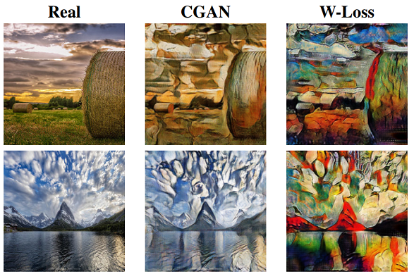
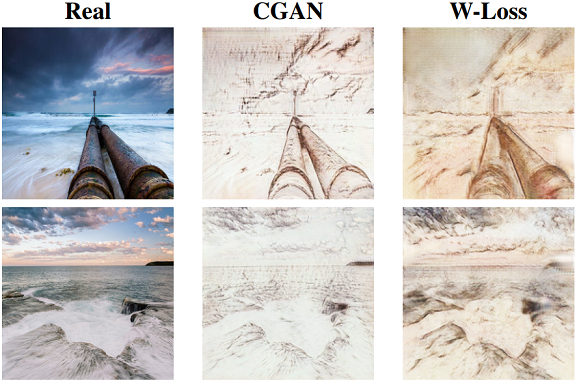
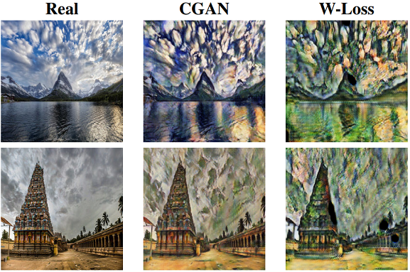

# CycleGAN with Wasserstein Loss

This repo is to demonestrate our submission for the project of High-level Computer Vision Course for Summer Semester 18 at Saarland University.

In this project, we combine a state-of-the-art GAN architecture, namely, CycleGAN with Wasserstein Loss.

The task at hand is style transfer, which in short is "drawing" captured images in the styles of medieval and modern artists, such as DaVinci, Picasso, etc. 

More details about the method and design choices are provided in the [project report](project_report.pdf).

# Example Results
Here, we show example results of our model getting results that better mimic the styles of the artists.
- Picasso: 


- Da Vinci:


- Cezanne:



# Running The Project
### Installation
- Install PyTorch 0.4 and dependencies from http://pytorch.org
- Install Torch vision from the source.
```bash
git clone https://github.com/pytorch/vision
cd vision
python setup.py install
```
- Install python libraries [visdom](https://github.com/facebookresearch/visdom) and [dominate](https://github.com/Knio/dominate).
```bash
pip install visdom
pip install dominate
```
- Alternatively, all dependencies can be installed by
```bash
pip install -r requirements.txt
```

### CycleGAN & Wasserstein train/test
- Download a CycleGAN dataset (e.g. maps):
```bash
bash ./datasets/download_cyclegan_dataset.sh maps
```
You can also use your own dataset. In our case, we used a subset of a Kaggle dataset of paintings, available [Here](https://www.kaggle.com/ikarus777/best-artworks-of-all-time).
- Train a model:
```bash
#!./scripts/train_cyclegan.sh
python train.py --dataroot ./datasets/maps --name maps_cyclegan --model cycle_gan
```
- To view training results and loss plots, run `python -m visdom.server` and click the URL http://localhost:8097. To see more intermediate results, check out `./checkpoints/maps_cyclegan/web/index.html`
- Test the model:
```bash
#!./scripts/test_cyclegan.sh
python test.py --dataroot ./datasets/maps --name maps_cyclegan --model cycle_gan
```
The test results will be saved to a html file here: `./results/maps_cyclegan/latest_test/index.html`.


## Acknowledgments
The code for CycleGAN was obtained from the original authors' [Github Repository](https://github.com/junyanz/pytorch-CycleGAN-and-pix2pix). We would like to thank the authors for releasing their source code.

Related Papers:

- Unpaired Image-to-Image Translation using Cycle-Consistent Adversarial Networks
[Jun-Yan Zhu](https://people.eecs.berkeley.edu/~junyanz/),  [Taesung Park](https://taesung.me/), [Phillip Isola](https://people.eecs.berkeley.edu/~isola/), [Alexei A. Efros](https://people.eecs.berkeley.edu/~efros)
In ICCV 2017. 


- Image-to-Image Translation with Conditional Adversarial Networks
[Phillip Isola](https://people.eecs.berkeley.edu/~isola), [Jun-Yan Zhu](https://people.eecs.berkeley.edu/~junyanz), [Tinghui Zhou](https://people.eecs.berkeley.edu/~tinghuiz), [Alexei A. Efros](https://people.eecs.berkeley.edu/~efros)
In CVPR 2017.
